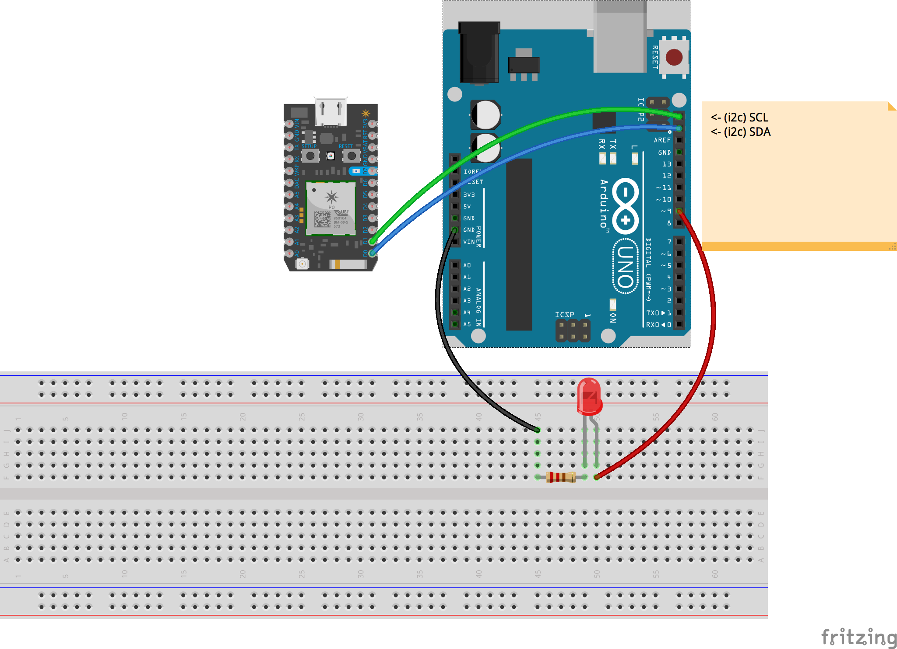

Johnny Five Photon ☛ I2C ☛ Arduino Uno 
=======================================

Example sketch how to communicate from a [Particle Photon](https://store.particle.io/#photon) to an [Arduino Uno R3](https://www.arduino.cc/en/Main/arduinoBoardUno) using [Johnny Five](http://johnny-five.io/), [Particle-io](https://github.com/rwaldron/particle-io) and the [Wire](https://www.arduino.cc/en/Reference/Wire) library via [I2C](https://en.wikipedia.org/wiki/I%C2%B2C) protocol.  

## Contents

- Arduino code
- Nodejs code
- hookup guide image and fritzing files

## Hardware  

- 1 × Particle Photon
- 1 × Arduino Uno
- 1 × Breadboard
- 4 x Jumperwires
- 1 × 220 Ω Resistor
- 1 × LED
- 1 × Computer 
- 1 × USB A ☛ B (Arduino)  
- 1 × USB A ☛ Micro USB or 5VPower Supply (Photon)  

## Hardware Hockup

The circuit is pretty simple. Just build it like in this image.  

  

## Prerequisites

- [Particle Account](https://build.particle.io/build)  
- Claim your Photon (follow [this guide](https://docs.particle.io/guide/getting-started/start/photon/))  
- Flash Voodospark to your Photon (follow [that guide](https://github.com/voodootikigod/voodoospark))  
- Install nvm __!Achtung:__ Johnny Five and Particle-io are not ready yet for the latest Nodejs version. You should use [nvm](https://github.com/creationix/nvm) to install older versions of Nodejs. nvm is for *nix systems, but they provide useful links to comparable projects for Windows.  
- Install Nodejs .v4.7.2 by running in [Terminal (MAC)](https://en.wikipedia.org/wiki/Terminal_(macOS)) `nvm install v4.7.2` (If you are on windows look at the guide of the node version manager you installed).  
- Download and install the [Arduino Software](http://arduino.cc/)  
- Open and flash the firmware `uno-receiver/uno-receiver.ino` with the Arduino software onto your board (keep it connected to usb)  
- (mac and *nix) Add your credentils to a .particlerc file (follow [another guide](https://github.com/rwaldron/particle-io#getting-started))  

## Usage macOS and *nix

- [open the Serial Monitor](https://learn.sparkfun.com/tutorials/terminal-basics/arduino-serial-monitor-windows-mac-linux) for the Ardunio

Run this code in terminal:  

    # move to the project folder
    cd path/to/project/folder/johnny-five-photon-uno-i2c/
    # tell nvm to use the version defined in the .nvmrc file
    nvm use  
    # install all dependencies for this project
    npm install  
    # run the code
    node index.js  
    # this will start the board
    # and open the Johnny Five REPL ([R]ead [E]val [P]rint [L]isten)
    # write into the repl
    >> write("foo or bah?")
    # whenever the Arduino received a message it will print 
    # the string passed to it there
    # and fade the LED up and down

### Notes:  

Code examples are taken from here

- https://github.com/rwaldron/johnny-five/issues/1184

Hookup guide is derived from here

- https://github.com/johnny-five-io/johnny-five.io/blob/master/src/news/particle-io-now-supports-i2c.md
- http://johnny-five.io/news/particle-io-now-supports-i2c/

## License 

The MIT License (MIT)

Copyright (c) 2017 Fabian Morón Zirfas & University of Applied Sciences Potsdam (Germany)   

Permission is hereby granted, free of charge, to any person obtaining a copy
of this software and associated documentation files (the "Software"), to deal
in the Software without restriction, including without limitation the rights
to use, copy, modify, merge, publish, distribute, sublicense, and/or sell
copies of the Software, and to permit persons to whom the Software is
furnished to do so, subject to the following conditions:

The above copyright notice and this permission notice shall be included in all
copies or substantial portions of the Software.

THE SOFTWARE IS PROVIDED "AS IS", WITHOUT WARRANTY OF ANY KIND, EXPRESS OR
IMPLIED, INCLUDING BUT NOT LIMITED TO THE WARRANTIES OF MERCHANTABILITY,
FITNESS FOR A PARTICULAR PURPOSE AND NONINFRINGEMENT. IN NO EVENT SHALL THE
AUTHORS OR COPYRIGHT HOLDERS BE LIABLE FOR ANY CLAIM, DAMAGES OR OTHER
LIABILITY, WHETHER IN AN ACTION OF CONTRACT, TORT OR OTHERWISE, ARISING FROM,
OUT OF OR IN CONNECTION WITH THE SOFTWARE OR THE USE OR OTHER DEALINGS IN THE
SOFTWARE.

